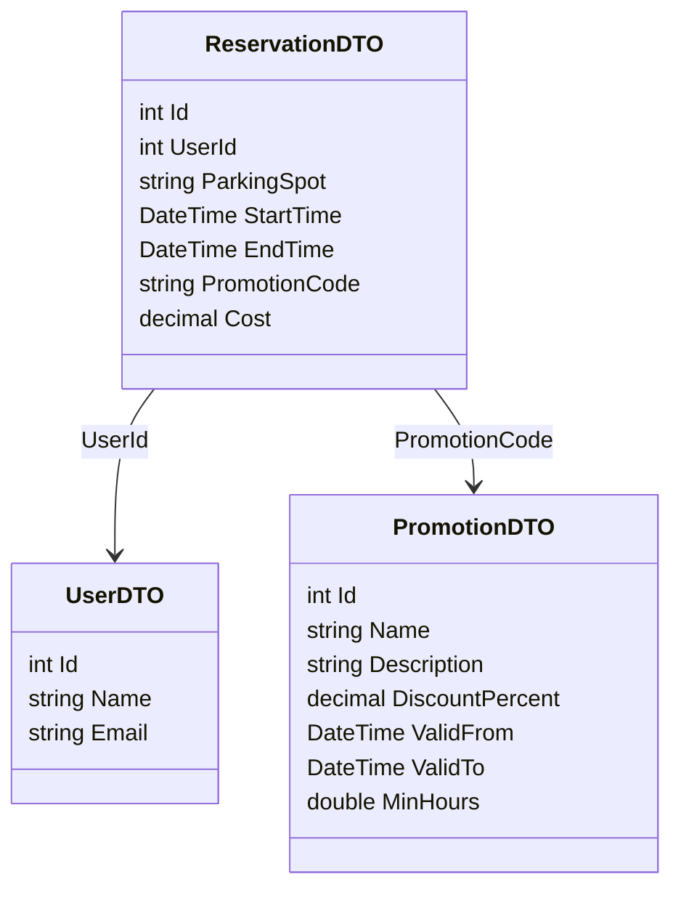

# System Parkingowy – Mikroserwisy

## Funkcjonalności i API

### UserService
CRUD użytkowników:
- `GET    /api/users` – lista użytkowników
- `GET    /api/users/{id}` – szczegóły użytkownika
- `POST   /api/users` – dodaj użytkownika
- `PUT    /api/users/{id}` – edytuj użytkownika
- `DELETE /api/users/{id}` – usuń użytkownika


**Model:**
```csharp
UserDTO {
  int Id
  string Name
  string Email
}
```

---

### PromotionService
CRUD promocji:
- `GET    /api/promotions` – lista promocji
- `GET    /api/promotions/{id}` – szczegóły promocji
- `GET    /api/promotions/code/{code}` – pobierz promocję po kodzie
- `POST   /api/promotions` – dodaj promocję
- `PUT    /api/promotions/{id}` – edytuj promocję
- `DELETE /api/promotions/{id}` – usuń promocję


**Model:**
```csharp
PromotionDTO {
  int Id
  string Name
  string Description
  decimal DiscountPercent
  DateTime ValidFrom
  DateTime ValidTo
  double MinHours
}
```

---

### ReservationService
CRUD rezerwacji:
- `GET    /api/reservations` – lista rezerwacji
- `GET    /api/reservations/{id}` – szczegóły rezerwacji
- `POST   /api/reservations` – dodaj rezerwację (sprawdza UserService i PromotionService)
- `PUT    /api/reservations/{id}` – edytuj rezerwację
- `DELETE /api/reservations/{id}` – usuń rezerwację

**Model:**
```csharp
ReservationDTO {
  int Id
  int UserId
  string ParkingSpot
  DateTime StartTime
  DateTime EndTime
  string PromotionCode
  decimal Cost
}
```


---

## Diagram klas (modele DTO)


---

## Diagram REST API
```mermaid
graph TD
  subgraph UserService
    U1[GET /api/users]
    U2[GET /api/users/{id}]
    U3[POST /api/users]
    U4[PUT /api/users/{id}]
    U5[DELETE /api/users/{id}]
  end
  subgraph PromotionService
    P1[GET /api/promotions]
    P2[GET /api/promotions/{id}]
    P3[GET /api/promotions/code/{code}]
    P4[POST /api/promotions]
    P5[PUT /api/promotions/{id}]
    P6[DELETE /api/promotions/{id}]
  end
  subgraph ReservationService
    R1[GET /api/reservations]
    R2[GET /api/reservations/{id}]
    R3[POST /api/reservations]
    R4[PUT /api/reservations/{id}]
    R5[DELETE /api/reservations/{id}]
  end
  R3 -- sprawdza --> U2
  R3 -- sprawdza --> P3
  R4 -- sprawdza --> U2
  R4 -- sprawdza --> P3
```

---

## Komunikacja
- ReservationService przy POST/PUT rezerwacji wywołuje UserService (`GET /api/users/{id}`) i PromotionService (`GET /api/promotions/code/{code}`) – synchronicznie, przez HTTP.
- Wszystkie dane w formacie JSON.

---

## Testy
- Każdy serwis ma testy jednostkowe i integracyjne (xUnit).
- Testy przechodzą na aktualnej konfiguracji.

---

## Zero logowania, rejestracji, profili – tylko CRUD i prosta walidacja relacji między serwisami. 
