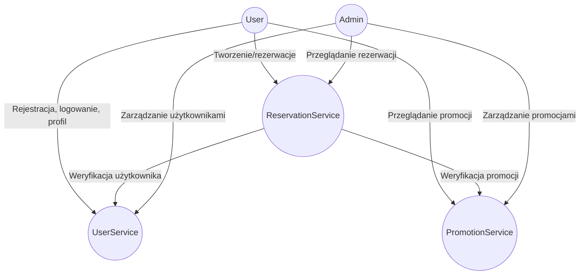
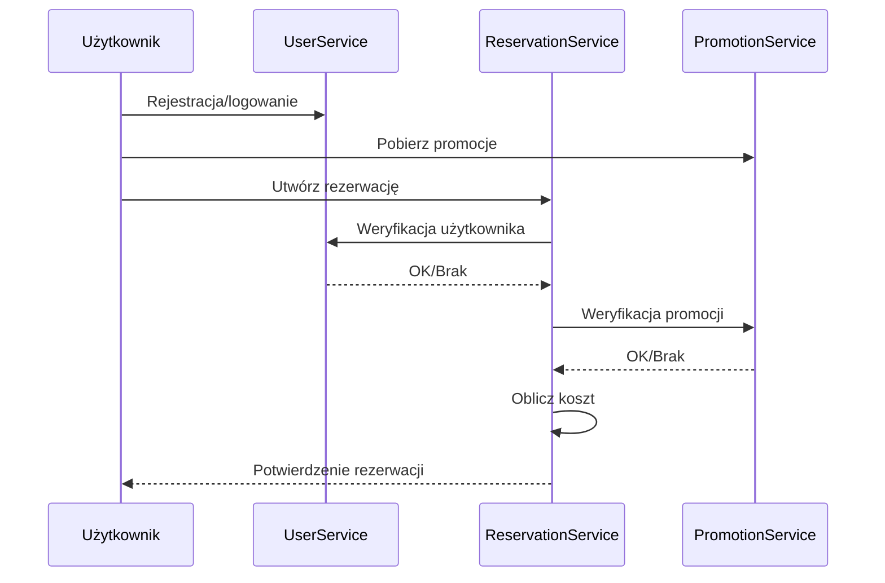

# System Parkingowy – Mikroserwisy

---

## 1. Architektura systemu

System składa się z trzech niezależnych serwisów:
- **UserService** – zarządzanie użytkownikami
- **ReservationService** – obsługa rezerwacji
- **PromotionService** – zarządzanie promocjami

Każdy serwis posiada własną bazę danych (SQL Server LocalDB) i udostępnia REST API. Komunikacja między serwisami odbywa się synchronicznie przez HTTP (JSON).

### Diagram architektury


---

## 2. Funkcjonalności serwisów (zgodnie z API)

### UserService
- Dodawanie nowego użytkownika (POST /api/users)
- Pobieranie listy użytkowników (GET /api/users)
- Pobieranie szczegółów użytkownika (GET /api/users/{id})
- Aktualizacja użytkownika (PUT /api/users/{id})
- Usuwanie użytkownika (DELETE /api/users/{id})
- Weryfikacja użytkownika na potrzeby ReservationService (GET /api/users/{id})

### ReservationService
- Tworzenie rezerwacji (POST /api/reservations)
- Pobieranie wszystkich rezerwacji (GET /api/reservations)
- Pobieranie rezerwacji konkretnego użytkownika (GET /api/reservations/user/{userId})
- Aktualizacja rezerwacji (PUT /api/reservations/{id})
- Usuwanie rezerwacji (DELETE /api/reservations/{id})
- Podczas tworzenia rezerwacji: sprawdzenie istnienia użytkownika (UserService) i promocji (PromotionService), obliczenie kosztu

### PromotionService
- Dodawanie promocji (POST /api/promotions)
- Pobieranie wszystkich promocji (GET /api/promotions)
- Pobieranie szczegółów promocji (GET /api/promotions/{id})
- Aktualizacja promocji (PUT /api/promotions/{id})
- Usuwanie promocji (DELETE /api/promotions/{id})
- Promocje są wykorzystywane przez ReservationService do naliczania zniżek

---

## 3. Przepływ działania i komunikacja

1. Użytkownik rejestruje się i loguje (UserService)
2. Przegląda promocje (PromotionService)
3. Tworzy rezerwację (ReservationService), podając swój ID i ewentualnie ID promocji
4. ReservationService:
   - Weryfikuje użytkownika przez UserService
   - Weryfikuje promocję przez PromotionService
   - Oblicza koszt rezerwacji
   - Zapisuje rezerwację
5. Użytkownik może przeglądać i edytować swoje rezerwacje

### Diagram przepływu (sequence)


---

## 3. Komunikacja między serwisami

Serwisy komunikują się synchronicznie przez REST API, przesyłając dane w formacie JSON. Każdy serwis działa niezależnie na własnym porcie.

### Przykład komunikacji: Tworzenie rezerwacji
1. **Klient** wysyła żądanie POST `/api/reservations` do ReservationService z danymi:
   ```json
   {
     "userId": 1,
     "promotionId": 2,
     "startTime": "2024-07-09T10:00:00",
     "endTime": "2024-07-09T12:00:00"
   }
   ```
2. **ReservationService**:
   - Wysyła zapytanie GET `/api/users/{userId}` do UserService, aby sprawdzić, czy użytkownik istnieje.
   - Wysyła zapytanie GET `/api/promotions/{promotionId}` do PromotionService, aby pobrać szczegóły promocji i sprawdzić warunki (np. minimalna liczba godzin).
   - Jeśli użytkownik lub promocja nie istnieje, zwraca błąd 400 lub 404 do klienta.
   - Jeśli wszystko jest OK, oblicza koszt rezerwacji z uwzględnieniem zniżki i zapisuje rezerwację w swojej bazie.
3. **ReservationService** zwraca klientowi szczegóły utworzonej rezerwacji:
   ```json
   {
     "id": 10,
     "userId": 1,
     "promotionId": 2,
     "startTime": "2024-07-09T10:00:00",
     "endTime": "2024-07-09T12:00:00",
     "cost": 20.00
   }
   ```

### Obsługa błędów
- Jeśli UserService lub PromotionService zwróci 404 (nie znaleziono), ReservationService nie tworzy rezerwacji i zwraca odpowiedni błąd klientowi.
- Jeśli wystąpi błąd połączenia z innym serwisem, klient otrzymuje błąd 503 (Service Unavailable).

### Podsumowanie
- Każdy serwis udostępnia tylko swoje API – nie ma bezpośredniego dostępu do cudzej bazy danych.
- Komunikacja jest synchroniczna: ReservationService czeka na odpowiedź UserService i PromotionService przed zapisaniem rezerwacji.
- Wszystkie dane przesyłane są jako JSON.

---

## 4. Model danych

### Diagram ERD
```mermaid
erDiagram
  USERS {
    int Id PK
    string Name
    string Email
    string Password
  }
  RESERVATIONS {
    int Id PK
    int UserId FK
    int PromotionId FK
    datetime StartTime
    datetime EndTime
    decimal Cost
  }
  PROMOTIONS {
    int Id PK
    string Name
    string Description
    decimal Discount
    int? MinHours
  }
  USERS ||--o{ RESERVATIONS : "ma"
  PROMOTIONS ||--o{ RESERVATIONS : "dotyczy"
```

---

## 5. Przypadki użycia (UML)
```mermaid
usecaseDiagram
actor "User" as User
actor "Admin" as Admin
User --> (Rejestracja)
User --> (Logowanie)
User --> (Przegląd profilu)
User --> (Tworzenie rezerwacji)
User --> (Przegląd rezerwacji)
User --> (Przegląd promocji)
Admin --> (Zarządzanie użytkownikami)
Admin --> (Zarządzanie promocjami)
Admin --> (Przegląd wszystkich rezerwacji)
```

---

## 6. Testy

- Każdy serwis posiada testy jednostkowe (xUnit) oraz testy integracyjne (xUnit + uruchamiane na żywych serwisach)
- Testy sprawdzają m.in.:
  - Poprawność rejestracji, logowania, CRUD użytkowników
  - Tworzenie i walidację rezerwacji (w tym komunikację z UserService i PromotionService)
  - Dodawanie, edycję i usuwanie promocji
- Testy integracyjne uruchamiane są automatycznie i **przechodzą poprawnie** (wszystkie przypadki pozytywne i negatywne)

#### Przykładowy przypadek testowy (Gherkin)
```gherkin
Scenario: Utworzenie rezerwacji z promocją
  Given użytkownik istnieje w systemie
  And promocja jest aktywna
  When użytkownik tworzy rezerwację z tą promocją
  Then rezerwacja zostaje utworzona z naliczoną zniżką
```

---

## 7. Stos technologiczny
- **Język:** C# (.NET 8)
- **Framework:** ASP.NET Core Web API
- **ORM:** Entity Framework Core
- **Baza danych:** SQL Server LocalDB
- **Testy:** xUnit
- **Diagramy:** Mermaid (w dokumentacji)
- **Narzędzia:** Swagger (dokumentacja API), Postman (testy integracyjne)

---

## 8. Instrukcja uruchamiania (aktualne porty)

1. **Wymagania:** .NET 8 SDK, SQL Server LocalDB
2. **Przygotowanie:**
   - `dotnet restore` (instalacja zależności)
   - `dotnet ef database update` w katalogu każdego serwisu (tworzy bazy)
3. **Uruchamianie serwisów (każdy w osobnej konsoli, na aktualnych portach HTTPS):**
   - `dotnet run --project UserService/UserService.csproj --urls=https://localhost:5005`
   - `dotnet run --project PromotionService/PromotionService.csproj --urls=https://localhost:5007`
   - `dotnet run --project ReservationService/ReservationService.csproj --urls=https://localhost:5009`
4. **Dokumentacja API** dostępna pod `/swagger` dla każdego serwisu (np. https://localhost:5005/swagger)
5. **Testy** uruchamiasz komendą `dotnet test` w katalogu testów każdego serwisu. Wszystkie testy jednostkowe i integracyjne przechodzą poprawnie.

---

## 9. Źródła i literatura
- Dokumentacja .NET: https://learn.microsoft.com/dotnet/
- Entity Framework Core: https://learn.microsoft.com/ef/core/
- REST API: https://restfulapi.net/
- Swagger: https://swagger.io/
- Postman: https://www.postman.com/ 