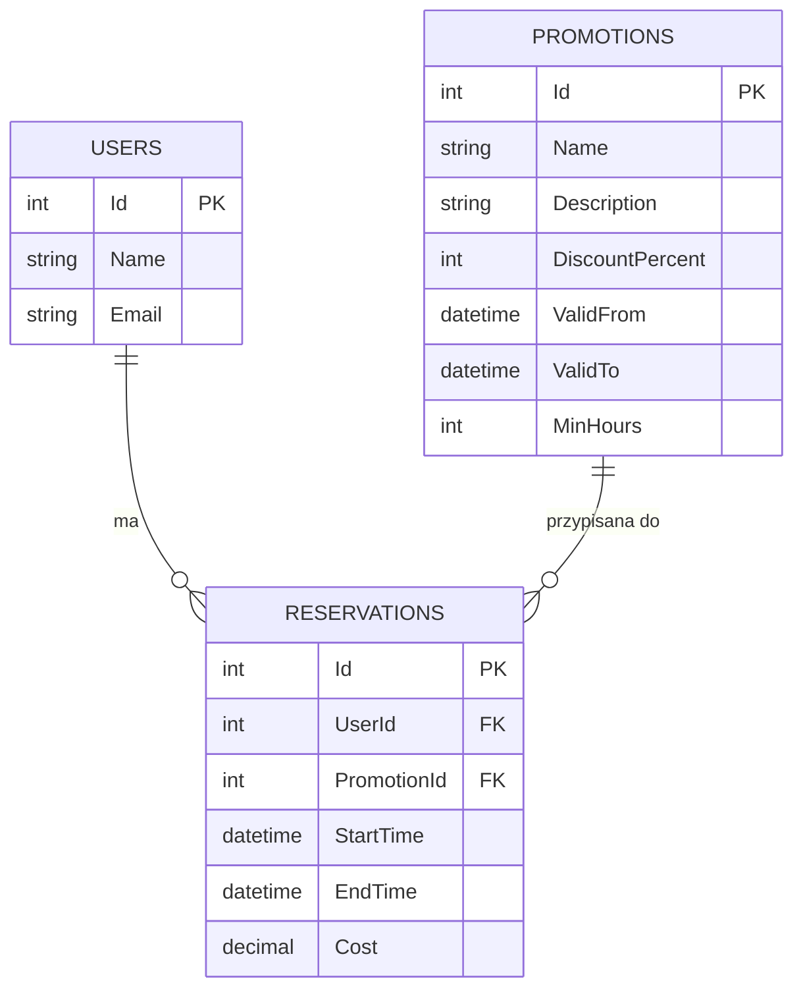
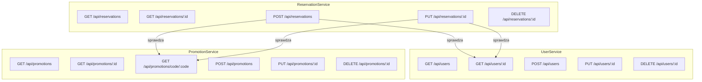
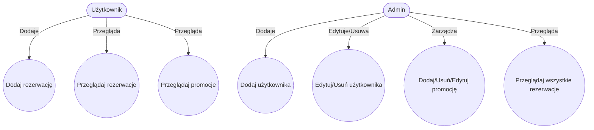

# System Parkingowy – Mikroserwisy

---

## 1. Stos technologiczny
- **Język:** C#
- **Framework:** .NET 8 (ASP.NET Core Web API)
- **Baza danych:** SQL Server LocalDB (każdy serwis ma własną bazę)
- **ORM:** Entity Framework Core
- **Testy:** xUnit (jednostkowe i integracyjne)
- **Diagramy:** Mermaid (ERD, REST, Use Case)
- **Narzędzia:** Swagger, Postman, Git

---

## 2. Instrukcja uruchamiania
1. **Wymagania:**
   - .NET 8 SDK
   - SQL Server LocalDB (domyślnie w Windows)
2. **Instalacja zależności:**
   ```powershell
   dotnet restore
   ```
3. **Tworzenie baz danych:**
   ```powershell
   dotnet ef database update --project UserService/UserService.csproj
   dotnet ef database update --project PromotionService/PromotionService.csproj
   dotnet ef database update --project ReservationService/ReservationService.csproj
   ```
4. **Uruchamianie serwisów (osobne konsole):**
   ```powershell
   dotnet run --project UserService/UserService.csproj --urls=https://localhost:5005
   dotnet run --project PromotionService/PromotionService.csproj --urls=https://localhost:5007
   dotnet run --project ReservationService/ReservationService.csproj --urls=https://localhost:5009
   ```
5. **Swagger:**
   - UserService: https://localhost:5005/swagger
   - PromotionService: https://localhost:5007/swagger
   - ReservationService: https://localhost:5009/swagger
6. **Testy:**
   ```powershell
   dotnet test
   ```

---

## 3. **Każdy projekt (UserService, PromotionService, ReservationService) posiada własne testy jednostkowe i integracyjne.** 

## API Endpoints

### UserService

| Metoda | Endpoint                | Opis                                      |
|--------|-------------------------|-------------------------------------------|
| GET    | `/api/users`            | Pobierz listę wszystkich użytkowników     |
| GET    | `/api/users/{id}`       | Pobierz użytkownika o podanym ID          |
| POST   | `/api/users`            | Dodaj nowego użytkownika                  |
| PUT    | `/api/users/{id}`       | Zaktualizuj dane użytkownika o podanym ID |
| DELETE | `/api/users/{id}`       | Usuń użytkownika o podanym ID             |

### PromotionService

| Metoda | Endpoint                   | Opis                                         |
|--------|----------------------------|----------------------------------------------|
| GET    | `/api/promotions`          | Pobierz listę wszystkich promocji            |
| GET    | `/api/promotions/{id}`     | Pobierz promocję o podanym ID                |
| POST   | `/api/promotions`          | Dodaj nową promocję                          |
| PUT    | `/api/promotions/{id}`     | Zaktualizuj promocję o podanym ID            |
| DELETE | `/api/promotions/{id}`     | Usuń promocję o podanym ID                   |

### ReservationService

| Metoda | Endpoint                        | Opis                                         |
|--------|---------------------------------|----------------------------------------------|
| GET    | `/api/reservations`             | Pobierz listę wszystkich rezerwacji          |
| GET    | `/api/reservations/{id}`        | Pobierz rezerwację o podanym ID              |
| POST   | `/api/reservations`             | Dodaj nową rezerwację                        |
| PUT    | `/api/reservations/{id}`        | Zaktualizuj rezerwację o podanym ID          |
| DELETE | `/api/reservations/{id}`        | Usuń rezerwację o podanym ID                 |

---


---

## 4. Diagram bazy danych (ERD)


---

## 5. Diagram REST API (endpointy i zależności)


---

## 6. Diagram przypadków użycia (UML)


---

## 7. Kluczowe elementy back-endu

### UserService
- **Kontroler:** UsersController (CRUD użytkowników)
- **Repozytorium:** UserRepository (operacje na bazie)
- **Model:** User, UserDTO

### PromotionService
- **Kontroler:** PromotionsController (CRUD promocji)
- **Repozytorium:** PromotionRepository
- **Model:** Promotion, PromotionDTO

### ReservationService
- **Kontroler:** ReservationsController (CRUD rezerwacji, walidacja user/promocja przez REST)
- **Repozytorium:** ReservationRepository
- **Model:** Reservation, PromotionDTO

---

## 8. Przypadki testowe (Gherkin)
### Przykład: Dodanie rezerwacji
```gherkin
Scenario: Dodanie nowej rezerwacji
  Given użytkownik istnieje w UserService
  And promocja istnieje w PromotionService
  When wysyłam POST /api/reservations z poprawnymi danymi
  Then otrzymuję status 201 Created
  And rezerwacja jest widoczna w GET /api/reservations
```

### Przykład: Usunięcie promocji
```gherkin
Scenario: Usunięcie promocji
  Given istnieje promocja w PromotionService
  When wysyłam DELETE /api/promotions/:id
  Then otrzymuję status 204 No Content
  And promocja znika z GET /api/promotions
```

---


## 9. Wykaz źródeł i literatury
- Dokumentacja Microsoft: [ASP.NET Core](https://learn.microsoft.com/aspnet/core/)
- Dokumentacja EF Core: [Entity Framework Core](https://learn.microsoft.com/ef/core/)
- [Mermaid Live Editor](https://mermaid.live/)
- [Swagger](https://swagger.io/)
- [xUnit](https://xunit.net/)
- Własny kod i testy

---

